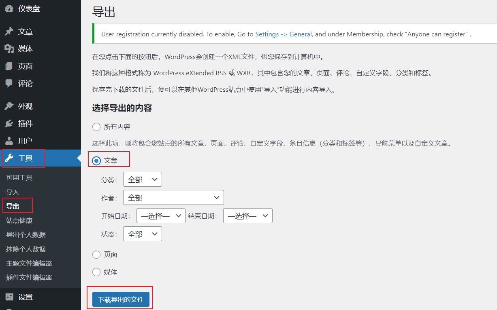
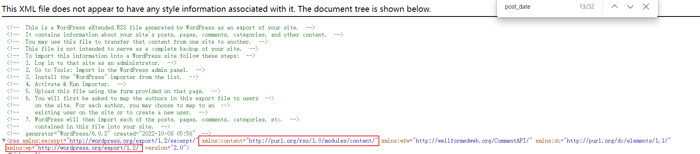
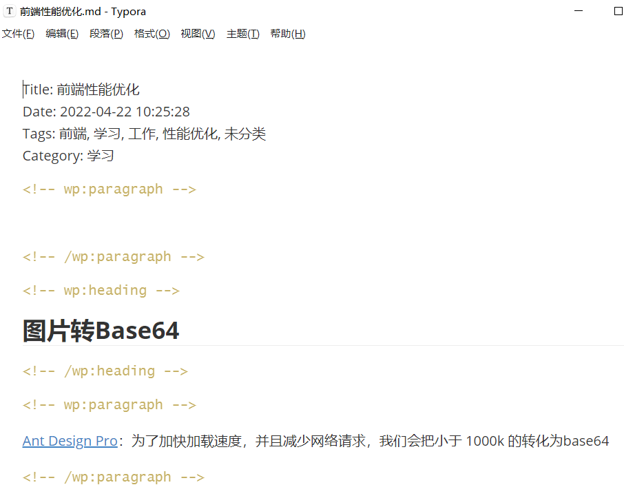

Title: Wordpress备份文件转Markdown(python)
Date: 2022-10-10 13:23:53
Category: Wordpress
Tags: python, Wordpress, 备份, Markdown, Pelican


###### 一、导出Wordpress备份文件

从wordpress admin 后台 - 工具 - 到处 -文章，下载导出的文件，**注意，一定要选文章**




###### 二、python转为markdown

创建xxx.py文件，代码如下

```python
# -*- coding: utf-8 -*-
from lxml import etree

import io
import sys
sys.stdout = io.TextIOWrapper(sys.stdout.buffer, encoding='utf8')


def getText(element):
    return element.text


def getCategory(elementList):
    for element in elementList:
        if element.attrib['domain'] == 'category':
            return element.text


def parse(wordpress_file):

    tree = etree.parse(wordpress_file)
    root = tree.getroot()

    for post in root.iter('item'):
        # Title
        title = getText(post.find('title'))
        output = open(output_path + '\\%s.md' %
                      title.replace(' ', '-').replace('/', '-'), 'w+', encoding='utf8')
        output.write("Title: %s" % title+"\n")
        outputT.write("Title: %s" % title+"\n")

        # Date
        date = post.find('{%s}post_date' % wp_namespace).text
        output.write("Date: %s" % date+"\n")
        outputT.write("Date: %s" % date+"\n")

        # Tags
        tags = post.findall('category')
        tagsList = ', '.join(list(map(getText, tags)))
        output.write("Tags: %s" % tagsList+"\n")
        outputT.write("Tags: %s" % tagsList+"\n")

        # Category
        category = getCategory(tags)
        output.write("Category: %s" % category+"\n")
        outputT.write("Category: %s" % category+"\n")

        content = post.find(
            '{%s}encoded' % content_namespace ).text.replace('\xa0', '')
        output.write("\n" + content+"\n")
        outputT.write("\n" + content+"\n")
        output.close()

###############################################################################


if __name__ == "__main__":
    # 备份文件绝对路径
    input_path = "C:\\Users\\SummerLiu\\Downloads\\WordPress.2022-10-08 (1).xml"

    # 目标Markdown文件夹的绝对路径
    output_path = "C:\\Users\\SummerLiu\\Downloads\\wordpress\\md"

    # namespace content
    content_namespace = 'http://purl.org/rss/1.0/modules/content/'

    # namespace wp
    wp_namespace = 'http://wordpress.org/export/1.2/'

    outputT = open(output_path + '\\total.md', 'w+', encoding='utf8')
    parse(input_path)
    outputT.close()
```

其中，input_path 为 备份文件的绝对路径，output_path为目标Markdown文件夹的绝对路径（文件夹提前建好，否则会报错文件夹不存在）

用浏览器打开Wordpress备份文件（后缀为.xml），看到下面红框框起来的两个网址，将蓝色网址粘贴到 content_namespace 和 wp_namespace 处进行替换，content_namespace对应xmlns:content后的网址，wp_namespace 对应xmlns:wp后的网址。


运行下面的命令，安装依赖库 lxml

`pip install lxml`


安装成功后，运行xxx.py文件

`python "c:\Users\Downloads\xxx.py"`


打开对应的文件夹，即可收获wordpress文章的Markdown文件

